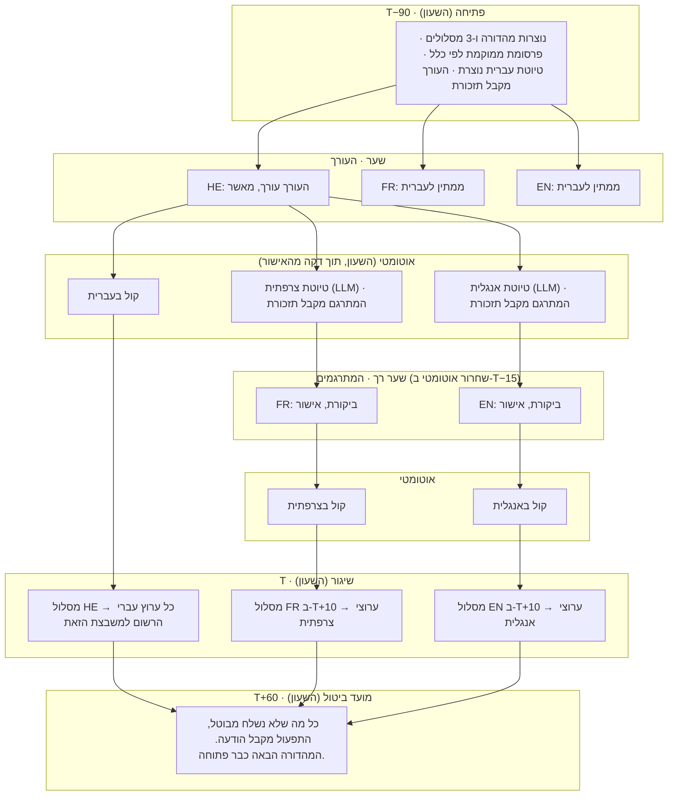

# מהדורה — משפך המהדורות

**מסמך עיצוב · תרגום לעברית · טיוטה 1 · 7 בספטמבר 2026.** תרגום מלא של
[`2026-09-07-editions-funnel-design.md`](2026-09-07-editions-funnel-design.md).
איך מהדורות החדשות נכתבות, מתורגמות, מוקלטות, משודכות לפרסומות ומופצות —
כך שאף אחד לא מעביר שום דבר מאדם לאדם.

היקף: המהדורה בעברית היוצאת שלוש פעמים ביום, לצד הגרסאות שלה בצרפתית
ובאנגלית — כל אחת כטקסט, קובץ קול ופרסומת משולמת אחת — מופצות לקהילות,
לקבוצות ולערוצים בוואטסאפ ולטלגרם. המחסנית הטכנולוגית כפי שהיא: n8n,
Supabase, Railway, WhatsApp דרך WaSender, וטלגרם. שלושת תהליכי ה-n8n
שכבר פועלים היום (יצירת טיוטה אוטומטית, הפקת קול בשלוש שפות, והשליחה
בעברית שלוש פעמים ביום) נשמרים כפי שהם ומקבלים רק "קורא" (caller) חדש.

*הערה על התרגום:* שמות שדות, טבלאות ופונקציות בקוד (SQL, n8n) נשארים
באנגלית במכוון, כפי שיוזנו במסד הנתונים ובתהליכים בפועל. מונחים טכניים
נפוצים (webhook, API, LLM, RLS ועוד) נשארים גם הם באנגלית, כמקובל בכתיבה
טכנית בעברית.

---

## התזה, בארבעה משפטים

1. **אף אחד לא שולח שום דבר לאף אחד.** כל אדם כותב למקום אחד בלבד: השורה
   של המהדורה ב-Supabase. המערכת עושה את כל ההפצה הלאה.
2. **מהדורה בשפה אחת היא *מסלול*, ומסלול הוא שורה אחת** שהעמודות שלה הן
   תוצריו: טיוטה, טקסט מאושר, קובץ קול, שיגורים. השלב שבו נמצא מסלול
   *נגזר* מאילו עמודות מולאו. אין עמודת סטטוס, ולכן אין שום דבר שצריך
   לסנכרן.
3. **שעון אחד מניע הכול.** תהליך ב-n8n רץ כל דקה, בודק כל מסלול, ועושה
   בדיוק את הדבר האחד שחסר לאותו מסלול. שום דבר לא ממתין בתוך n8n, ושום
   דבר לא נשמר מחוץ לשורה.
4. **אנשים הם שערים, לא שליחים.** האישור של עורך המהדורה הוא השער היחיד
   שהוא חובה. כל מה שבא אחריו ממשיך לבד, אלא אם מישהו לוחץ **החזק**.

התוצאה היא משפך: מהדורות נכנסות מלמעלה על פי לוח זמנים, נופלות דרך
שערים, ויוצאות למטה כהודעות. כל שלב מסתכל רק על השורה שמולו.

---

## מה משתנה לכל אדם

| תפקיד | היום, לכל מהדורה | בעיצוב החדש, לכל מהדורה |
|---|---|---|
| **עורך המהדורה** | עורך את הטיוטה; שולח אותה לתפעול; שולח אותה לשני מתרגמים | עורך את הטיוטה, לוחץ **אישור**. פעולה אחת. |
| **המתרגמים** (צרפתית, אנגלית) | מתרגמים מאפס; שולחים את התוצאה לתפעול | קוראים את הטיוטה שהמכונה הפיקה לצד העברית המאושרת, מתקנים, לוחצים **אישור**. אם לא עושים כלום — המועד האחרון משחרר את הטיוטה (מדיניות, ראו בהמשך). |
| **מנהל הפרסום** | בוחר ומעביר את הפרסומת שמתאימה לכל מהדורה | שום דבר לכל מהדורה. מגדיר **קמפיין** פעם אחת (מדיה, טקסט, כמה מהדורות, תאריכים, משבצות) והמערכת ממקמת אותו. יכול להצמיד פרסומת למהדורה מסוימת כשזה חשוב. |
| **צוות התפעול** | מקבל שלושה טקסטים, מעביר כל אחד להפקת קול, אוסף טקסט + קול + פרסומת, שולח ידנית לכל סוג קהילה וערוץ | שום דבר לכל מהדורה. אחראי על **מרשם הערוצים** ומטפל ב**חריגים**: החזקה, שחרור, ניסיון חוזר, ערוץ שהפסיק לעבוד. |

| מדד | היום | בעיצוב החדש |
|---|---|---|
| מעברים ידניים למהדורה | 9 | **0** |
| פעולות אנוש למהדורה (שלוש שפות) | כ-15 | **3** (עורך 1, מתרגמים 2 — או 1 כשהמועד האחרון משחרר אותם) |
| אנשים על הנתיב הקריטי | 4 | **1** (העורך) |

---

## כל שלב בתהליך הקיים, בבדיקה

| # | היום | פסיקה | למה |
|---|---|---|---|
| 1 | מנהל הפרסום משדך פרסומת לכל מהדורה | **החלפה** בקמפיינים ומיקום אוטומטי | זה מכריח שני אנשים להסתנכרן על כל מהדורה. ההחלטה ("הפרסומת הזאת, עוד שש פעמים, בבקרים, לפני ה-20") היא כלל תזמון, לא שיקול דעת. כללים מריצים את עצמם. |
| 2 | העורך עורך את הטיוטה שנוצרה אוטומטית | **שימור** | אחריות עריכתית. השער היחיד שחייב להיות אדם. הוא מקבל מועד אחרון על המסך וטיוטה שמגיעה בזמן. |
| 3 | העורך שולח את הטקסט לתפעול | **הסרה** | האישור *הוא* השליחה. השורה משתנה; השעון רואה את זה. |
| 4 | העורך שולח את הטקסט למתרגמים | **הסרה** | השעון יוצר את הטיוטות בצרפתית ובאנגלית ברגע שהעברית מאושרת, ומזכיר למתרגמים עם קישור. |
| 5 | התפעול מעביר את העברית להפקת קול | **הסרה** | הפקת הקול כבר אוטומטית. הטריגר הופך להיות "טקסט מאושר בלי קול", לא אדם. |
| 6 | המתרגמים מתרגמים | **החלפה** בביקורת | העורך כבר אישר את *התוכן*; מה שנשאר הוא שפה. ביקורת על תרגום מכונה של טקסט מאושר היא עבודה של חמש דקות, לא ארבעים, ואפשר לתת לה מועד אחרון שפותר את עצמו. |
| 7 | המתרגמים שולחים לתפעול | **הסרה** | כמו 3. |
| 8 | התפעול מעביר צרפתית ואנגלית להפקת קול | **הסרה** | כמו 5. |
| 9 | התפעול ממתין ומרכיב טקסט + קול + פרסומת | **הסרה** | "האם החבילה שלמה?" היא שאילתה על שורה אחת, לא עבודה. |
| 10 | התפעול שולח ידנית לכל סוג קהילה ולערוצים | **החלפה** בשיגור מתוזמן דרך מרשם ערוצים | השליחה בעברית שלוש פעמים ביום כבר אוטומטית לסוג קהילה אחד. המרשם הופך את שאר הסוגים, את קהלי פעם-ביום ואת שורות הטלגרם, לרשומות בטבלה — לא לתהליכים נפרדים. |
| 11 | מוצר נפרד של פעם ביום | **מיזוג** | משבצת. קהלי פעם-ביום נרשמים אליה במרשם. אם הטקסט שלה הוא מהדורת הערב במדויק, הם נרשמים ל-`evening` ואין בכלל משבצת רביעית. |
| 12 | מבט אנושי אחרון לפני השליחה | **הסרה כשער** | שימור כבלם. שלושה אנשים כבר אישרו את החלקים. מבט רביעי מוסיף השהיה, לא ביטחון, וזאת הסיבה העיקרית שמהדורות יוצאות מאוחר. במקומו: הכול נראה כ*מוכן* מוקדם, ואפשר ללחוץ **החזק** בכל רגע עד השנייה שהוא יוצא. |

---

## המשפך

שלושה מסלולים (HE, FR, EN) לכל מהדורה. הזמן זורם כלפי מטה. `T` הוא זמן
השליחה של המהדורה.



כללים שהופכים את זה למשפך ולא למכונת מצבים:

- **טקסט הוא חובה; קול ופרסומת הם רשות.** בזמן השליחה מסלול יוצא עם מה
  שיש לו. קול חסר ממתין לכל היותר חמש דקות (`audio_grace`), ואז הטקסט
  יוצא בלעדיו והתפעול מקבל הודעה. מסלול בלי פרסומת יוצא בלי פרסומת.
- **מאוחר נשלח, מיושן מבוטל.** מסלול שמתבשל אחרי זמן השליחה שלו יוצא
  מיד. מסלול שעדיין לא מוכן ב-`T + cutoff` (60 דקות) מבוטל — המהדורה
  הבאה כבר בדרך, וצהריים של אתמול הם לא חדשות.
- **העברית לעולם לא משתחררת אוטומטית.** צרפתית ואנגלית כן, כמדיניות, כי
  התוכן כבר אושר ורק השפה על הכף. מתרגם שרוצה לעצור טיוטה גרועה לוחץ
  **דחייה**, מה שהופך את השער של אותו מסלול לקשיח למהדורה הזאת.
- **החזקה מנצחת הכול.** `held_at` על המהדורה עוצר את כל המסלולים שלה
  בשלב השיגור; **שחרור** ממשיך; החזקה שנמשכת אחרי מועד הביטול הופכת
  לביטול.

---

## מהדורת צהריים, דקה אחר דקה

ברירות מחדל: מרווח פתיחה 90, חלון ביקורת 15, היסט שליחה לצרפתית/אנגלית
10, מועד ביטול 60, תזכורת 45, הסלמה 20, מרווח חסד לקול 5.

| שעה | מה קורה | מי |
|---|---|---|
| 10:30 | המהדורה נפתחת. הפרסומת ממוקמת. טיוטת העברית נוצרת. העורך מקבל "מהדורת צהריים — טיוטה מוכנה, דדליין 11:15" עם קישור. | השעון |
| 10:30–11:15 | העורך עורך ומאשר. | העורך |
| 11:15 | תזכורת אם עדיין לא אושר. | השעון |
| 11:16 | קול בעברית מתחיל (כ-2 דקות). טיוטות בצרפתית ובאנגלית נוצרות (כדקה). המתרגמים מקבלים תזכורת. | השעון |
| 11:17–11:45 | המתרגמים בודקים ומאשרים. | המתרגמים |
| 11:40 | הסלמה לתפעול אם העברית *עדיין* לא אושרה. | השעון |
| 11:45 | כל מסלול צרפתי/אנגלי שלא טופל משתחרר כמו שהוא בטיוטה. הקול שלהם מתחיל. | השעון |
| 12:00 | המסלול העברי משוגר לכל ערוץ עברי הרשום למשבצת `noon`. | השעון |
| 12:10 | המסלולים בצרפתית ובאנגלית משוגרים. | השעון |
| 13:00 | מועד ביטול. כל מה שלא נשלח מבוטל והתפעול מקבל הודעה. | השעון |

התפעול לא נגע בכלום. הם היו שומעים ב-11:40, ב-12:05 (קול שנכשל או ערוץ
שנכשל) או ב-13:00, ורק אז.

---

## מודל הנתונים

קידומת `news_` כי פרויקט ה-Supabase משותף, בדיוק כמו הארכיון. ה-DDL
המלא בנספח א׳.

| טבלה | שורה אחת היא… | הערות |
|---|---|---|
| `news_slot` | שעה ביום שבה יוצאות מהדורות | `send_time`, `days`, `lead_min`, `cutoff_min`, `ads_per_edition`, `part_order` |
| `news_lang` | מסלול שפה | `gate` (`required` / `auto_release`), `review_window_min`, `send_offset_min`, קול ל-TTS |
| `news_blackout` | יום ללא מהדורות | חגים |
| `news_setting` | כפתור גלובלי | `audio_grace_min`, `remind_min`, `escalate_min`, `max_attempts`, `send_pace_ms` |
| `news_staff` | איש צוות | `roles[]`, `langs[]`, מספר וואטסאפ לתזכורות |
| `news_edition` | משבצת אחת ביום אחד (או מהדורת בזק) | `send_at`, `held_at`, `cancelled_at` |
| `news_lane` | מהדורה אחת בשפה אחת | `draft`, `text`, `approved_at/by/via`, `rejected_at`, `audio_url`, `sent_at`, וחותמות התפיסה |
| `news_notice` | תזכורת שנשלחה | `(lane, kind)` — אידמפוטנטיות להודעות לצוות |
| `news_channel` | קהל יעד | פלטפורמה, מזהה חיצוני, `lang`, `slots[]`, `active` |
| `news_delivery` | הודעה אחת לערוץ אחד | `(lane, channel, part)` — אידמפוטנטיות לשליחות, והוכחת פרסום |
| `news_campaign` | פרסומת שמנהל הפרסום מכר | מדיה, `quota` (מהדורות), תאריכים, `slots[]`, `langs[]`, `priority` |
| `news_campaign_text` | הכיתוב של הפרסומת בשפה אחת | טיוטת מכונה, מנהל הפרסום עורך |
| `news_edition_ad` | פרסומת שמוקמה במהדורה | `pinned_by` כשהוצמדה ידנית |

השלב של מסלול הוא תצוגה (view), לעולם לא עמודה:

```sql
case
  when l.sent_at      is not null                       then 'sent'
  when e.cancelled_at is not null                       then 'cancelled'
  when e.held_at      is not null                       then 'held'
  when l.lang <> 'he' and src.approved_at is null       then 'waiting_source'
  when l.draft is null and l.text is null               then 'drafting'
  when l.approved_at  is null                           then 'review'
  when l.audio_url is null and l.audio_error is null    then 'audio'
  else                                                       'ready'
end
```

עמודת סטטוס הייתה נסחפת ברגע הראשון שערוץ נכשל אחרי שהשורה כבר אמרה
"נשלח". זה לא יכול להיסחף: זו *השורה עצמה*.

מצב שקיים רק כדי למנוע עבודה כפולה — `draft_requested_at`,
`audio_requested_at`, `claimed_at`, `news_notice`, `news_delivery` —
מקומי לשורה אחת, ופג תוקף או אידמפוטנטי לפי מפתח. שום דבר לא משותף בין
שתי פונקציות מלבד הטבלה עצמה.

---

## מדיניות: הגדרות, לא קוד

| כפתור | ברירת מחדל | חי ב־ | למה הערך הזה |
|---|---|---|---|
| פתיחת מהדורה | `T−90` | slot | מספיק זמן לטיוטה, לעריכה, לביקורת תרגום ולשתי עבודות קול, עם רזרבה |
| תזכורת / הסלמה לעורך | `T−45` / `T−20` | setting | ב-20 מינוס עוד אפשר לתקן; ב-10 מינוס כבר לא |
| שער העברית | `required` | lang | אחריות עריכתית לעולם לא משתחררת לבד |
| שער הצרפתית/אנגלית | `auto_release` ב-`T−15` | lang | התוכן כבר אושר; מועד אחרון הוא ביטחון טוב יותר מאדם שיצא לצהריים. אפשר להפוך ל-`required` לכל שפה בשורה אחת אם האיכות תדרוש. |
| היסט שליחה צרפתית/אנגלית | `+10 min` | lang | שומר על העברית בזמן גם כשתרגום מתעכב |
| מרווח חסד לקול | 5 דקות | setting | טקסט בזמן עדיף על קול בזמן |
| מועד ביטול | `T+60` | slot | אחרי זה המהדורה הבאה היא החדשות |
| פרסומות למהדורה | 1 | slot | |
| סדר ההודעה | טקסט ← קול ← פרסומת | slot | תואם את הנוהג היום; שינוי של שורה אחת |
| קצב שליחה | 1.5 שנ׳ בין הודעות | setting | הסבילות של וואטסאפ, לא שלנו |
| ניסיונות חוזרים | 4, נסיגה מדורגת 1·2·4·8 דקות | setting | |

---

## פרסומות: קמפיינים, לא שידוך לכל מהדורה

מנהל הפרסום מוכר **קמפיין**: מפרסם, מדיה (תמונה או וידאו, ב-Supabase
storage), כיתוב, קישור, **מכסה** (בכמה מהדורות הוא יופיע), טווח
תאריכים, אילו משבצות, אילו שפות, עדיפות.

**המיקום הוא כלל, שרץ כשהמהדורה נפתחת.** המועמדים הם קמפיינים פעילים
בטווח התאריכים, למשבצת וליום הזה, עם מכסה שנותרה. הם מסודרים לפי
דחיפות — כמה מיקומים נותרו חלקי כמה מהדורות נותרו בחלון של הקמפיין —
ואז לפי עדיפות. ה-`ads_per_edition` העליונים ממוקמים. קמפיין שמפגר
מנצח לכן יותר, ופרסומת שיכולה עוד לחכות — מוותרת. מנהל הפרסום רואה
תצוגת **קצב** לכל קמפיין (מכסה, מוקם, נשלח, נותר, בקצב או לא) ומקבל
התראה כשקמפיין לא יספיק להיגמר בזמן.

**הכיתובים בכל שפה נכתבים אוטומטית על ידי מכונה** ברגע שקמפיין נשמר עם
כיתוב עברי בלבד, ומנהל הפרסום עורך אותם. מתרגמים לא נוגעים בפרסומות
בכלל; שתי הפונקציות נשארות מנותקות זו מזו.

**הצמדה** היא הפעולה היחידה שנשארת לכל מהדורה, והיא רשות: להציב *את
הקמפיין הזה* *במהדורה הזאת*. הצמדות נספרות במכסה בדיוק כמו כל מיקום
אחר.

**הוכחת הפרסום** מגיעה בחינם: טבלת השיגורים (`news_delivery`) מתעדת כל
הודעת פרסומת שבאמת נשלחה, לכל ערוץ, עם מזהה ההודעה של הספק. דוח לקמפיין
הוא שאילתה.

"שליחה" אחת של פרסומת פירושה מהדורה אחת — כל השפות והערוצים שלה. אם
מפרסם קונה לפי הודעה בודדת במקום, טבלת השיגורים כבר סופרת הודעות; רק
היחידה של המכסה משתנה.

---

## ערוצים ושליחה

`news_channel` הוא המרשם: פלטפורמה (`whatsapp_group`,
`whatsapp_community`, `whatsapp_channel`, `telegram_channel`,
`telegram_group`), מזהה חיצוני, שפה, והמשבצות שהיא רשומה אליהן. כיבוי
קהילה הוא `active = false`. הוספת קהל של פעם ביום היא שורה הרשומה
ל-`daily` (או ל-`evening`). יש משגר אחד והוא קורא את הטבלה הזאת; "סוגי
הקהילות" הם שורות, לא תהליכים.

תת־התהליך ה**משגר** לוקח מסלול, טוען את הערוצים שלו, ולכל ערוץ שולח את
החלקים לפי `part_order` שאין להם עדיין שורת שיגור מוצלחת: *טקסט* (הטקסט
המאושר), *קול* (הקובץ, כהודעה קולית היכן שהפלטפורמה מאפשרת), *פרסומת*
(מדיה עם הכיתוב בשפת המסלול). כל הודעה כותבת את שורת השיגור שלה. הקצב
בין הודעות הוא כפתור הגדרות. בטוח להריץ פעמיים: ההרצה השנייה לא מוצאת
מה לשלוח.

מתאמים: ה-API של WaSender לוואטסאפ, הצומת (node) של טלגרם ב-n8n
לטלגרם. אם יתברר ש-WaSender לא מצליח לפרסם ל*ערוץ* וואטסאפ (broadcast),
הפלטפורמה של אותו ערוץ הופכת ל-`manual`: המשגר כותב שורת שיגור מסומנת
כידנית, הדסק מציג כרטיס "העתק ופרסם", והתפעול מסמן שבוצע. שלב ידני אחד,
מוכל וגלוי — במקום תהליך ידני שלם.

---

## הדסק

אפליקציית ווב סטטית ודקה (Supabase Auth, Supabase JS, אבטחה ברמת
השורה — RLS), באותה צורה כמו הממשק הניהולי של הארכיון. אין לה שרת: כל
כלל שהיא אוכפת הוא פונקציה ב-Postgres, וכל פעולה שהיא מבצעת היא שינוי
שורה שהשעון יבחין בו. מתארחת ב-Railway כאתר סטטי (או GitHub Pages; זה
קבצים).

| מסך | למי | מציג | פעולות |
|---|---|---|---|
| **התור שלי** | עורכים, מתרגמים | מסלולים שממתינים לי, ממוינים לפי מועד אחרון, עם ספירה לאחור | פתיחה לעורך |
| **העורך (המסך)** | עורכים, מתרגמים | הטיוטה; למתרגמים — העברית המאושרת לצדה | **אישור** (עם נעילה אופטימית — שמירה של עורך שני על גרסה ישנה נדחית, לא דורסת), **דחייה** (למתרגמים) |
| **הלוח** | תפעול, כולם | מהדורות היום כמשבצת × שפה, כל תא צבוע לפי שלב; פתיחת מסלול מציגה טקסט, נגן קול, פרסומת וסטטוס שיגור לכל ערוץ | **החזק / שחרר**, **שלח עכשיו**, **נסה שוב קול**, **נסה שוב כשלים**, **מהדורת בזק חדשה** |
| **קמפיינים** | מנהל הפרסום | קמפיינים עם פסי קצב; יומן שיגורים לכל קמפיין | יצירה, עריכה, השהיה, **הצמדה למהדורה**, ייצוא הוכחה |
| **ערוצים** | תפעול | המרשם | הוספה, עריכה, הפעלה/כיבוי |
| **הגדרות** | מנהל מערכת | משבצות, שפות, מדיניות, ימים חסומים | עריכה |

תזכורות נשלחות לצוות בוואטסאפ (הם כבר שם), כל אחת עם קישור ישיר למסך
הרלוונטי בדסק. אף אחד לא צריך להשאיר את הדסק פתוח; הדסק הוא המקום שבו
נוחתים כשהטלפון מרטיט.

---

## כשמשהו משתבש

| תקלה | מה המערכת עושה | מה אדם רואה |
|---|---|---|
| יצירת הטיוטה נכשלת | ניסיון חוזר עד 3 פעמים; המסלול נשאר ב"יצירת טיוטה" | העורך מקבל תזכורת "אין טיוטה — לכתוב מאפס"; השער לא משתנה |
| העורך מפספס את המועד | תזכורת ב-T−45, הסלמה ב-T−20; שום דבר לא נשלח; מועד הביטול מבטל | התפעול מחליט: לדחוף לעורך, או לכתוב בעצמו |
| התרגום האוטומטי נכשל | למסלול אין טיוטה; שחרור אוטומטי לא יכול לחול (אין מה לשחרר) | המתרגם והתפעול מקבלים תזכורת; השער של אותו מסלול קשיח בפועל |
| הקול נכשל | הטקסט יוצא אחרי תקופת החסד; חלק הקול מנוסה שוב עד מועד הביטול, ונשלח באיחור אם הצליח | התפעול רואה תא קול אדום; **נסה שוב קול** |
| חיבור WaSender נופל | כל שיגור נכשל; ניסיון חוזר בנסיגה מדורגת; הגל מפעיל התראה אחת | התפעול מחבר מחדש את החיבור, לוחץ **נסה שוב כשלים** (או ממתין — שלב הניסיון החוזר עושה זאת) |
| הודעה יצאה שגויה | לוואטסאפ אין ביטול שליחה; העורך פותח **מהדורת בזק** עם התיקון, אותו משפך, `send_at = now + 15` | |
| n8n לא פעיל | שום דבר לא קורה; כשהוא חוזר, הבדיקה הבאה משלימה את הפער, כי כל שלב הוא "עדיין חסר" | פינג של דופק מהבדיקה למערכת ניטור מעורר אזעקה אחרי 5 דקות שקטות |
| שני אנשים עורכים מסלול אחד | פונקציית האישור משווה `updated_at`; השמירה הישנה נדחית | "המסלול הזה השתנה מאז שפתחת אותו — לרענן" |
| חג או שבת | `news_blackout` מדלג על היום; `days` של משבצת מדלג על שבת | |

---

## תוכנית הטמעה

כל שלב מסיר קבוצת מעברים מוגדרת; שום דבר לא ממתין לשלב מאוחר יותר.

| שלב | בנייה | מעברים שהוסרו |
|---|---|---|
| **1 · עברית מקצה לקצה** (כשבוע) | סכימה; השעון עם פתיחה, טיוטה, תזכורת, קול, שיגור, סגירה; התור והעורך של העורך; הלוח; מרשם הערוצים טעון בכל קהל עברי כולל טלגרם וקהלי פעם-ביום; שלושת התהליכים הקיימים עטופים כתת-תהליכים שמקבלים `lane_id` | עורך→תפעול, תפעול→קול (עברית), תפעול→קהילות |
| **2 · מסלולי תרגום** (שבוע) | שלב תרגום; תור מתרגמים; מדיניות שפה; קול ושיגור לצרפתית/אנגלית | עורך→מתרגמים ×2, מתרגמים→תפעול ×2, תפעול→קול ×2 |
| **3 · קמפיינים** (שבוע) | טבלאות קמפיין, כלל מיקום, חלק הפרסומת במשגר, תצוגת קצב, ייצוא הוכחה | מנהל פרסום→תפעול |
| **4 · כיוונון** | מעבר צרפתית/אנגלית ל-`auto_release` אחרי שבוע של ביקורות שמראה שהטיוטות טובות; ימים חסומים; מהדורות בזק; ספי התראה | האחרון ממתין |

אחרי שלב 1 איש התפעול כבר לא שולח שום דבר ידנית, בשום שפה, לשום קהל,
והאישור של העורך הוא הדבר היחיד שבין טיוטה לטלפונים.

---

## החלטות שהתקבלו כדי שלא תצטרכו

כל אחת היא שורה אחת או שורת קוד אחת להפוך.

1. **שעון בקרה מחזורי, לא webhooks.** יציבות על פני שישים שניות של השהיה.
2. **המתרגמים בודקים; המועד האחרון משחרר.** צרפתית/אנגלית `auto_release`
   ב-T−15. עברית לעולם לא.
3. **אין כפתור שליחה סופי.** מוכן נראה מוקדם; **החזק** הוא הבלם; השליחה
   היא השעון.
4. **פרסומות הן קמפיינים עם מכסה במהדורות**, ממוקמות לפי דחיפות כשהמהדורה
   נפתחת, אחת למהדורה. הצמדה קיימת לחריגים.
5. **כיתובי פרסומת נכתבים אוטומטית לכל שפה ובבעלות מנהל הפרסום**, לא
   המתרגמים.
6. **מוצר פעם-ביום הוא משבצת**, או מנוי ל-`evening` אם זה אותו טקסט.
7. **טקסט הוא חובה; קול ופרסומת הם רשות** בזמן השליחה. חמש דקות חסד
   לקול.
8. **שישים דקות אחרי זמן השליחה, מסלולים שלא נשלחו מבוטלים.** מהדורות
   מיושנות לעולם לא נשלחות.
9. **סדר ההודעה: טקסט, קול, פרסומת**, לכל משבצת.
10. **הדסק סטטי; הכללים ב-SQL; n8n הוא קלט/פלט.** אותה צורה כמו הממשק
    הניהולי של הארכיון, אותה יכולת בדיקה.
11. **תזכורות בוואטסאפ**, לא אימייל, עם קישורים ישירים.
12. **ערוצי וואטסאפ נופלים לכרטיס ידני** אם WaSender לא מצליח לפרסם
    אליהם.
13. **קידומת טבלה `news_`**, פרויקט Supabase משותף אחד, כמו הארכיון.

---

## נספח א׳ — סכימה (הצעה)

הקוד עצמו (SQL) נשאר באנגלית במכוון — כך אפשר להעתיק אותו ישירות
ל-Supabase בלי סיכון של שגיאת תרגום בשם שדה או טבלה. ה-DDL המלא, כולל
כל שלוש-עשרה הטבלאות, שתי התצוגות וחתימות הפונקציות, מופיע בנספח א׳ של
הגרסה האנגלית:
[`2026-09-07-editions-funnel-design.md#appendix-a--schema-proposal`](2026-09-07-editions-funnel-design.md).

תמצית הטבלאות והתפקיד של כל אחת מופיעה למעלה, בפרק "מודל הנתונים".

---

## נספח ב׳ — מלאי תהליכי n8n

| תהליך | טריגר | עושה | כותב |
|---|---|---|---|
| `tick` | Schedule, כל דקה, בלי חפיפה | `select * from news_claim_work()` ← Switch לפי `action` ← Execute Workflow בלי המתנה | — |
| `draft-he` *(קיים, עטוף)* | Execute Workflow `{lane_id}` | הגנרטור של היום | `news_lane.draft` |
| `translate` | Execute Workflow `{lane_id}` | עברית מאושרת ← LLM ← טיוטה בשפת המסלול | `news_lane.draft` |
| `audio` *(קיים, עטוף)* | Execute Workflow `{lane_id}` | TTS עם הגדרות ה-`tts` של המסלול ← Supabase storage | `news_lane.audio_url` או `audio_error` |
| `dispatch` *(שולח קיים, מוכלל)* | Execute Workflow `{lane_id}` | ערוצי המסלול ← חלקים בלי שיגור ← WaSender / טלגרם, בקצב | `news_delivery`, `news_lane.sent_at` |
| `notify` | Execute Workflow `{staff, kind, lane_id}` | הודעת וואטסאפ עם קישור ישיר | `news_notice` |
| `translate-ad` | נקרא על ידי `tick` לקמפיינים שחסרה להם שפה | טיוטת כיתוב מ-LLM | `news_campaign_text` |
| תהליך שגיאות | n8n Error Trigger | הודעה אחת לתפעול | — |

התהליכים הקיימים משתנים בדרך אחת בלבד: הם מקבלים `lane_id` וכותבים את
התוצאה שלהם חזרה לאותו מסלול, במקום למה שהם כותבים אליו היום. הפנים
שלהם נשארות כפי שהן.
