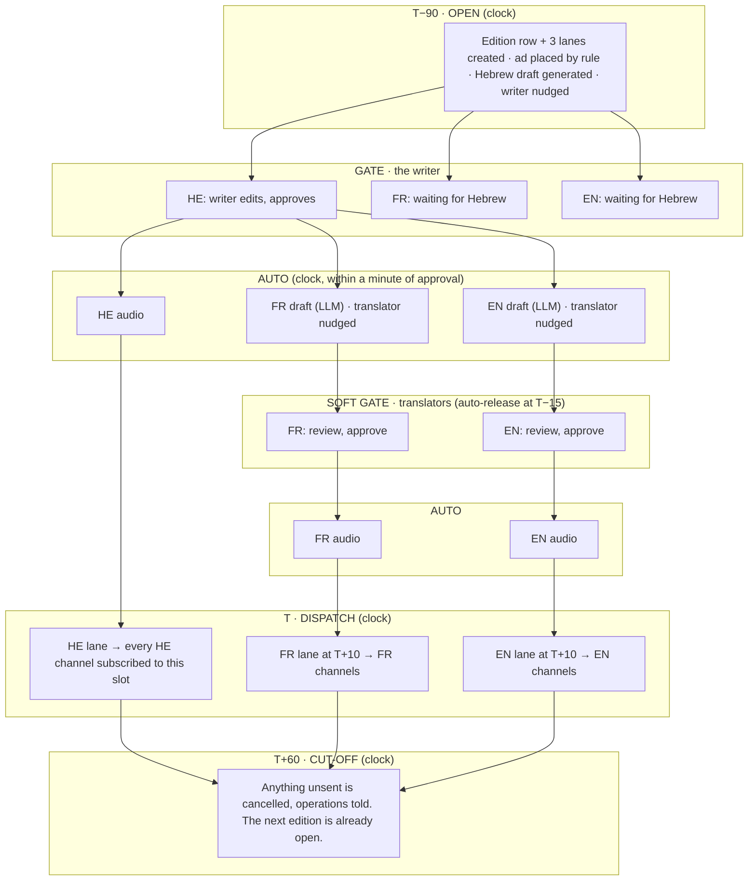

# Mahadura (מהדורה) — the editions funnel

**Design spec · 2026-09-07 · draft 1.** How the news editions (מהדורות) get written,
translated, voiced, sold against and delivered — with nobody carrying anything
from one person to the next.

Scope: the thrice-daily Hebrew edition and its French and English versions, each
as text + audio + one paid ad, delivered to WhatsApp communities, groups and
channels and to Telegram. Stack as it stands: n8n, Supabase, Railway, WhatsApp
through WaSender, Telegram. The three n8n workflows that already run (draft
generation, audio in three languages, the 3×/day Hebrew send) are kept and
re-used as they are; they only get a new caller.

---

## The thesis, in four sentences

1. **Nobody sends anything to anybody.** Every person writes into one place: the
   edition's row in Supabase. The system does all the fan-out.
2. **An edition in one language is a *lane*, and a lane is one row** whose
   columns are its artifacts: draft, approved text, audio, deliveries. Its stage
   is *derived* from which columns are filled. There is no status field, so
   there is nothing to keep in sync.
3. **One clock moves everything.** An n8n workflow runs every minute, looks at
   every lane, and does the one thing that lane is missing. Nothing waits inside
   n8n and nothing is remembered outside the row.
4. **People are gates, not couriers.** The writer's approval is the only hard
   gate. Everything after it moves on its own unless somebody presses *Hold*.

The result is a funnel: editions enter at the top on a schedule, fall through
gates, and leave at the bottom as messages. Each stage looks only at the row in
front of it.

---

## What changes for each person

| Role | Today, per edition | Designed, per edition |
|---|---|---|
| **Writer** | Edit the draft; send it to ops; send it to two translators | Edit the draft, press **Approve**. One action. |
| **Translators** (FR, EN) | Translate from scratch; send the result to ops | Read the machine draft beside the approved Hebrew, fix, press **Approve**. If they do nothing, the deadline releases the draft (policy, see below). |
| **Ads manager** | Pick and hand over the ad that goes with each edition | Nothing per edition. Defines a **campaign** once (media, text, how many editions, dates, slots) and the system places it. May pin an ad to a specific edition when it matters. |
| **Operations** | Receive three texts, forward each to audio, collect text + audio + ad, send by hand to each kind of community and channel | Nothing per edition. Owns the **channel registry** and handles **exceptions**: hold, release, retry, a channel that stopped working. |

| Measure | Today | Designed |
|---|---|---|
| Hand-carried transfers per edition | 9 | **0** |
| Human actions per edition (three languages) | ≈15 | **3** (writer 1, translators 2 — or 1 when the deadline releases them) |
| People on the critical path | 4 | **1** (the writer) |

---

## Every step of today's flow, questioned

| # | Today | Verdict | Why |
|---|---|---|---|
| 1 | Ads manager matches an ad to each edition | **Replace** with campaigns + automatic placement | It forces two people to synchronise on every edition. The decision ("this ad, six more times, mornings, before the 20th") is a scheduling rule, not a judgement. Rules run themselves. |
| 2 | Writer edits the generated draft | **Keep** | Editorial responsibility. This is the one gate that must be a person. It gets a deadline shown on screen and a draft that arrives on time. |
| 3 | Writer sends the text to operations | **Remove** | Approval *is* the send. The row changes; the clock sees it. |
| 4 | Writer sends the text to the translators | **Remove** | The clock creates the French and English drafts the minute Hebrew is approved and nudges the translators with a link. |
| 5 | Operations forwards Hebrew to audio production | **Remove** | Audio is already automatic. The trigger becomes "approved text with no audio", not a person. |
| 6 | Translators translate | **Replace** with review | The writer already approved the *content*; what remains is language. Reviewing a machine translation of approved text is a five-minute job, not a forty-minute one, and it can have a deadline that resolves itself. |
| 7 | Translators send to operations | **Remove** | Same as 3. |
| 8 | Operations forwards French and English to audio | **Remove** | Same as 5. |
| 9 | Operations waits for and assembles text + audio + ad | **Remove** | "Is the bundle complete?" is a query over one row, not a job. |
| 10 | Operations sends by hand to each kind of community and to the channels | **Replace** with scheduled dispatch through a channel registry | The 3×/day Hebrew send is already automated for one kind of community. The registry makes the other kinds, the once-a-day audiences and Telegram rows in a table, not separate processes. |
| 11 | A separate once-a-day product | **Merge** | A slot. Once-a-day audiences subscribe to it in the registry. If its text is the evening edition verbatim, they subscribe to `evening` and there is no fourth slot at all. |
| 12 | A final human look before sending | **Remove as a gate, keep as a brake** | Three people already approved the parts. A fourth look adds latency, not safety, and is the main reason editions go out late. Instead: everything is visibly *ready* before its send time, and operations can press **Hold** at any point up to the second it goes. |

---

## The funnel

Three lanes (HE, FR, EN) per edition. Time runs downward. `T` is the edition's
send time.



Rules that make it a funnel rather than a state machine:

- **Text is required; audio and ad are optional.** At send time a lane goes out
  with whatever it has. Missing audio waits at most five minutes (`audio_grace`),
  then the text goes without it and operations is told. A lane with no ad goes
  without an ad.
- **Late is sent, stale is cancelled.** A lane that becomes ready after its send
  time goes immediately. A lane still not ready at `T + cutoff` (60 min) is
  cancelled — the next edition is coming and yesterday's noon is not news.
- **Hebrew never auto-releases.** French and English do, by policy, because the
  content has already been approved and only the language is at stake. A
  translator who wants to stop a bad draft presses **Reject**, which turns that
  lane's gate hard for this edition.
- **Hold beats everything.** `held_at` on the edition stops all its lanes at the
  dispatcher; **Release** resumes; a hold that lasts past cut-off becomes a
  cancellation.

---

## The clock

One n8n workflow, *Schedule Trigger* every minute, set to never overlap itself.
It runs one SQL function, `news_claim_work()`, and executes what comes back.
The function does the moves that need no outside world and *returns* the ones
that do, each one already claimed so the next minute does not hand it out
twice. Every step is "find rows that lack X, do X, mark X".

| # | Step | Finds | Does |
|---|---|---|---|
| 1 | **open** | an active slot whose `send_time − lead` has passed today, today is not a blackout day and this weekday is in the slot's `days`, and no edition exists for (today, slot) | inserts the edition and its lanes, places ads (`news_place_ads`) |
| 2 | **draft** | HE lanes with no draft; FR/EN lanes whose Hebrew is approved and have no draft | calls the draft generator / the translator sub-workflow, stamps `draft_requested_at` |
| 3 | **nudge** | lanes in *review* with no `draft_ready` notice; HE lanes unapproved at `T−45` (reminder to the writer) and `T−20` (escalation to operations) | sends a WhatsApp message with a deep link, records the notice |
| 4 | **release** | lanes whose language policy is `auto_release`, unapproved, not rejected, past `T − review_window` | `text = draft, approved_at = now(), approved_via = 'auto'` |
| 5 | **audio** | approved lanes with no audio and no audio error | calls the audio sub-workflow, stamps `audio_requested_at` |
| 6 | **dispatch** | approved lanes, not held, not sent, past their due time, audio present or failed or grace expired, not claimed | claims the lane (`claimed_at`), calls the dispatcher sub-workflow |
| 7 | **retry** | delivery rows with an error, attempts below the limit, `next_attempt_at` passed | re-sends that one message |
| 8 | **close** | editions past `send_at + cutoff` with unsent lanes | cancels them, notifies operations |

Claims expire: a `*_requested_at` or `claimed_at` older than ten minutes with no
result is handed out again. That is the whole crash-recovery story, because
every sub-workflow is idempotent by key (lane for drafts and audio; lane +
channel + part for deliveries).

**Why a clock and not database webhooks.** A webhook is instant but fragile:
if n8n is down for the minute the writer approves, the lane is stuck until
someone notices. A clock that reconciles is at most sixty seconds slower in a
ninety-minute cycle, needs no `pg_net`, no secrets in triggers, no retry logic
per handler, and heals itself — whatever failed last minute is simply still
missing this minute. Webhooks can be added later as a latency optimisation on
top of the same table; they would never replace the clock.

**Why the rules live in SQL.** `news_claim_work()` is one function with every
deadline and policy in it. It can be unit-tested with pgTAP like the archive's
schema, read in one screen, and changed without touching n8n. n8n does what n8n
is good at: talking to WaSender, Telegram, the LLM and the TTS.

---

## A noon edition, minute by minute

Defaults: `lead 90`, `review_window 15`, `send_offset` FR/EN `10`, `cutoff 60`,
`remind 45`, `escalate 20`, `audio_grace 5`.

| Time | What happens | Who |
|---|---|---|
| 10:30 | Edition opens. Ad placed. Hebrew draft generated. Writer gets "מהדורת צהריים — טיוטה מוכנה, דדליין 11:15" with a link. | clock |
| 10:30–11:15 | Writer edits and approves. | writer |
| 11:15 | Reminder if still unapproved. | clock |
| 11:16 | Hebrew audio starts (≈2 min). French and English drafts generated (≈1 min). Translators nudged. | clock |
| 11:17–11:45 | Translators review and approve. | translators |
| 11:40 | Escalation to operations if Hebrew is *still* unapproved. | clock |
| 11:45 | Any untouched FR/EN lane is released as drafted. Their audio starts. | clock |
| 12:00 | Hebrew lane dispatched to every Hebrew channel subscribed to `noon`. | clock |
| 12:10 | French and English lanes dispatched. | clock |
| 13:00 | Cut-off. Anything unsent is cancelled and operations told. | clock |

Operations touched nothing. They would have been told at 11:40, 12:05 (a failed
audio or a failed channel) or 13:00, and only then.

---

## Data model

Prefix `news_` because the Supabase project is shared, like the archive's. Full
DDL in Appendix A.

| Table | One row is… | Notes |
|---|---|---|
| `news_slot` | a time of day editions go out | `send_time`, `days`, `lead_min`, `cutoff_min`, `ads_per_edition`, `part_order` |
| `news_lang` | a language lane | `gate` (`required` / `auto_release`), `review_window_min`, `send_offset_min`, TTS voice |
| `news_blackout` | a day with no editions | chagim |
| `news_setting` | a global dial | `audio_grace_min`, `remind_min`, `escalate_min`, `max_attempts`, `send_pace_ms` |
| `news_staff` | a person | `roles[]`, `langs[]`, WhatsApp number for nudges |
| `news_edition` | one slot on one day (or one flash edition) | `send_at`, `held_at`, `cancelled_at` |
| `news_lane` | one edition in one language | `draft`, `text`, `approved_at/by/via`, `rejected_at`, `audio_url`, `sent_at`, plus the claim stamps |
| `news_notice` | a nudge that was sent | `(lane, kind)` — idempotency for messages to staff |
| `news_channel` | an audience | platform, external id, `lang`, `slots[]`, `active` |
| `news_delivery` | one message to one channel | `(lane, channel, part)` — idempotency for sends, and proof of publication |
| `news_campaign` | an ad the ads manager sold | media, `quota` (editions), dates, `slots[]`, `langs[]`, `priority` |
| `news_campaign_text` | the ad's caption in one language | machine-drafted, ads manager edits |
| `news_edition_ad` | an ad placed in an edition | `pinned_by` when placed by hand |

The stage of a lane is a view, never a column:

```sql
case
  when l.sent_at      is not null                       then 'sent'
  when e.cancelled_at is not null                       then 'cancelled'
  when e.held_at      is not null                       then 'held'
  when l.lang <> 'he' and src.approved_at is null       then 'waiting_source'
  when l.draft is null and l.text is null               then 'drafting'
  when l.approved_at  is null                           then 'review'
  when l.audio_url is null and l.audio_error is null    then 'audio'
  else                                                       'ready'
end
```

A status column would drift the first time a channel failed after the row said
"sent". This cannot drift: it *is* the row.

State that exists only to prevent double work — `draft_requested_at`,
`audio_requested_at`, `claimed_at`, `news_notice`, `news_delivery` — is local to
one row and expires or is idempotent by key. Nothing is shared between two
functions except the table itself.

---

## Policies: configuration, not code

| Dial | Default | Lives in | Why this value |
|---|---|---|---|
| Edition opens | `T−90` | slot | enough for a draft, an edit, a translation review and two audio jobs, with slack |
| Writer reminder / escalation | `T−45` / `T−20` | setting | at −20 a person can still fix it; at −10 they cannot |
| Hebrew gate | `required` | lang | editorial responsibility never auto-releases |
| FR/EN gate | `auto_release` at `T−15` | lang | content already approved; the deadline is a better guarantee than a person who is at lunch. Flip to `required` per language in one row if quality says so. |
| FR/EN send offset | `+10 min` | lang | keeps Hebrew on time even when a translation runs late |
| Audio grace | `5 min` | setting | text on time beats audio on time |
| Cut-off | `T+60` | slot | after that the next edition is the news |
| Ads per edition | `1` | slot | |
| Message order | text → audio → ad | slot | mirrors today's practice; a one-line change |
| Send pacing | `1.5 s` between messages | setting | WhatsApp's tolerance, not ours |
| Retries | `4`, backoff 1·2·4·8 min | setting | |

---

## Ads: campaigns, not per-edition matching

The ads manager sells a **campaign**: advertiser, media (image or video, stored
in Supabase storage), a caption, a link, a **quota** (how many editions it
appears in), a date range, which slots, which languages, a priority.

**Placement is a rule, run when the edition opens.** Candidates are active
campaigns in range for this day and slot with quota remaining. They are ordered
by urgency — remaining placements divided by editions left in the campaign's
window — then priority. The top `ads_per_edition` are placed. A campaign that
is falling behind therefore wins more often, and an ad that could still wait
yields. The ads manager sees a **pacing** view per campaign (quota, placed,
delivered, remaining, on-track or not) and is alerted when a campaign cannot
finish on time.

**Captions per language are machine-drafted** the moment a campaign is saved
with only a Hebrew caption, and the ads manager edits them. Translators never
touch ads; the two functions stay decoupled.

**Pinning** is the only per-edition action left, and it is optional: place *this*
campaign in *this* edition. Pinned placements are counted against quota like any
other.

**Proof of publication** comes free: `news_delivery` records every ad message
actually delivered, per channel, with the provider's message id. A campaign's
report is a query.

One "send" of an ad means one edition — all its languages and channels. If an
advertiser buys per message instead, the delivery table already counts messages;
only the quota's unit changes.

---

## Channels and sending

`news_channel` is the registry: platform (`whatsapp_group`, `whatsapp_community`,
`whatsapp_channel`, `telegram_channel`, `telegram_group`), external id, language,
and the slots it subscribes to. Turning a community off is `active = false`.
Adding a once-a-day audience is a row subscribed to `daily` (or to `evening`).
There is one dispatcher and it reads this table; "the kinds of communities" are
rows, not workflows.

The **dispatcher** sub-workflow takes a lane, loads its channels, and for each
channel sends the parts in `part_order` that have no successful delivery row:
`text` (the approved text), `audio` (the file, as a voice note where the
platform allows), `ad` (media with the caption in the lane's language). Each
message writes its delivery row. Pacing between messages is a setting. It is
safe to run twice: the second run finds nothing to send.

Adapters: WaSender's HTTP API for WhatsApp, n8n's Telegram node for Telegram.
If WaSender turns out not to post to a WhatsApp *Channel* (broadcast), that
channel's platform is `manual`: the dispatcher writes a delivery row marked
manual, the Desk shows a "copy and post" card, operations marks it done. One
contained manual step, visible, instead of a whole manual process.

---

## The Desk

A thin static web app (Supabase Auth, Supabase JS, row-level security), the
same shape as the archive's admin. It has no server: every rule it enforces is
a Postgres function, and every action it takes is a row change the clock will
notice. Hosted on Railway as a static site (or GitHub Pages; it is files).

| Screen | For | Shows | Actions |
|---|---|---|---|
| **My queue** | writers, translators | lanes waiting for me, sorted by deadline, with a countdown | open → editor |
| **Editor** | writers, translators | the draft; for translators the approved Hebrew beside it | **Approve** (with an optimistic lock — a second editor's stale save is refused, not overwritten), **Reject** (translators) |
| **Board** | operations, everyone | today's editions as slot × language, each cell coloured by stage; a lane opens to its text, audio player, ad, and per-channel delivery status | **Hold / Release**, **Send now**, **Retry audio**, **Retry failed**, **New flash edition** |
| **Campaigns** | ads manager | campaigns with pacing bars; per-campaign delivery log | create, edit, pause, **Pin to edition**, export proof |
| **Channels** | operations | the registry | add, edit, toggle |
| **Settings** | admin | slots, languages, policies, blackout days | edit |

Nudges go to staff on WhatsApp (they live there already), each with a deep link
into the relevant Desk screen. Nobody needs to keep the Desk open; the Desk is
where you land when the phone buzzes.

---

## When things go wrong

| Failure | What the system does | What a person sees |
|---|---|---|
| Draft generator fails | retries up to 3 times; lane stays *drafting* | writer is nudged with "no draft — write from scratch"; the gate is unchanged |
| Writer misses the deadline | reminder at T−45, escalation at T−20; nothing is sent; cut-off cancels | operations decides: nudge the writer, or write it |
| Machine translation fails | lane has no draft; auto-release cannot apply (nothing to release) | translator and operations nudged; that lane's gate is effectively hard |
| Audio fails | text goes out after the grace period; audio part is retried until cut-off and sent late if it arrives | operations sees the red audio cell; **Retry audio** |
| WaSender session drops | every delivery fails; retries with backoff; the burst triggers one alert | operations reconnects the session, presses **Retry failed** (or waits — the retry step does it) |
| A message went out wrong | WhatsApp has no unsend; the writer opens a **flash** edition with the correction, same funnel, `send_at = now + 15` | |
| n8n is down | nothing happens; when it returns, the next tick catches up (every step is "still missing") | a heartbeat ping from the tick to an uptime monitor raises the alarm after 5 silent minutes |
| Two people edit one lane | the approve RPC compares `updated_at`; the stale save is refused | "This lane changed since you opened it — reload" |
| Wrong send time on a holiday | `news_blackout` skips the day; a slot's `days` skips Shabbat | |

---

## Delivery plan

Each phase removes a specific set of transfers; nothing waits on a later phase.

| Phase | Build | Transfers removed |
|---|---|---|
| **1 · Hebrew end to end** (about a week) | schema; the clock with open, draft, nudge, audio, dispatch, close; the writer's queue and editor; the board; the channel registry loaded with *every* Hebrew audience including Telegram and the once-a-day ones; the three existing workflows wrapped as sub-workflows taking `lane_id` | writer→ops, ops→audio (HE), ops→communities |
| **2 · Translation lanes** (a week) | translate step; translator queue; language policies; FR/EN audio and dispatch | writer→translators ×2, translators→ops ×2, ops→audio ×2 |
| **3 · Campaigns** (a week) | campaign tables, placement rule, ad part in the dispatcher, pacing view, proof export | ads manager→ops |
| **4 · Tuning** | flip FR/EN to `auto_release` once a week of reviews shows the drafts are good; blackout days; flash editions; alert thresholds | the last waits |

After phase 1 the operations worker no longer sends anything by hand, in any
language, to any audience, and the writer's approval is the only thing between
a draft and the phones.

---

## Decisions taken so you do not have to

Each one is a single row or a single line to flip.

1. **A reconciling clock, not webhooks.** Robustness over sixty seconds of latency.
2. **Translators review; the deadline releases.** FR/EN `auto_release` at T−15. Hebrew never.
3. **No final send button.** Ready is visible early; *Hold* is the brake; the send is the clock.
4. **Ads are campaigns with a quota in editions**, placed by urgency when the edition opens, one per edition. Pinning exists for the exceptions.
5. **Ad captions are machine-drafted per language and owned by the ads manager**, not by the translators.
6. **The once-a-day product is a slot** (or a subscription to `evening`, if it is the same text).
7. **Text is required; audio and ad are optional** at send time. Five minutes of grace for audio.
8. **Sixty minutes after send time, unsent lanes are cancelled.** Stale editions are never sent.
9. **Message order text → audio → ad**, per slot.
10. **The Desk is static; the rules are SQL; n8n is I/O.** Same shape as the archive's admin, same testability.
11. **Nudges on WhatsApp**, not email, with deep links.
12. **WhatsApp Channels fall back to a manual card** if WaSender cannot post to them.
13. **Table prefix `news_`**, one shared Supabase project, like the archive.

---

## Appendix A — schema (proposal)

```sql
-- Mahadura schema, proposal 2026-09-07. Prefix news_ because the Supabase
-- project is shared. Postgres 15, Supabase Auth.

create extension if not exists pgcrypto;

-- ------------------------------------------------------------- configuration

create table news_lang (
  code               text primary key,                  -- 'he', 'fr', 'en'
  name               text not null,
  gate               text not null default 'required'
                     check (gate in ('required', 'auto_release')),
  review_window_min  integer not null default 15,       -- auto_release fires at send_at − this
  send_offset_min    integer not null default 0,        -- this lane goes out this long after send_at
  tts                jsonb   not null default '{}',     -- voice, rate… handed to the audio workflow untouched
  active             boolean not null default true
);

create table news_slot (
  key              text primary key,                    -- 'morning', 'noon', 'evening', 'daily', 'flash'
  send_time        time,                                -- local time (Asia/Jerusalem); null for flash
  days             smallint[] not null default '{0,1,2,3,4,5,6}',  -- 0 = Sunday
  lead_min         integer  not null default 90,        -- the edition opens this long before send_time
  cutoff_min       integer  not null default 60,        -- unsent lanes are cancelled this long after send_at
  ads_per_edition  smallint not null default 1,
  part_order       text[]   not null default '{text,audio,ad}',
  active           boolean  not null default true
);

create table news_blackout (
  day     date primary key,                             -- no editions open on these days
  reason  text
);

create table news_setting (                             -- audio_grace_min, remind_min, escalate_min,
  key    text primary key,                              -- max_attempts, send_pace_ms, desk_url, tz
  value  jsonb not null
);

create table news_staff (
  user_id  uuid primary key references auth.users (id) on delete cascade,
  name     text    not null,
  roles    text[]  not null,                            -- writer | translator | ads | ops | admin
  langs    text[]  not null default '{}',               -- lanes this writer/translator may approve
  phone    text,                                        -- WhatsApp number for nudges
  active   boolean not null default true
);

-- ----------------------------------------------------------------- the funnel

create table news_edition (
  id             uuid primary key default gen_random_uuid(),
  day            date not null,
  slot           text not null references news_slot (key),
  kind           text not null default 'scheduled' check (kind in ('scheduled', 'flash')),
  send_at        timestamptz not null,
  held_at        timestamptz,
  held_by        uuid references news_staff (user_id),
  cancelled_at   timestamptz,
  cancel_reason  text,
  created_at     timestamptz not null default now()
);

-- One scheduled edition per slot per day. Flash editions are unlimited.
create unique index news_edition_scheduled_uq
  on news_edition (day, slot) where kind = 'scheduled';

create table news_lane (
  id                  uuid primary key default gen_random_uuid(),
  edition_id          uuid not null references news_edition (id) on delete cascade,
  lang                text not null references news_lang (code),
  -- stage 1: a draft appears
  draft               text,
  draft_requested_at  timestamptz,
  draft_attempts      smallint not null default 0,
  draft_error         text,
  -- stage 2: a person, or the deadline, approves a text
  text                text,
  approved_at         timestamptz,
  approved_by         uuid references news_staff (user_id),
  approved_via        text check (approved_via in ('desk', 'auto')),
  rejected_at         timestamptz,                      -- a translator's "do not auto-release this one"
  -- stage 3: audio appears
  audio_url           text,
  audio_requested_at  timestamptz,
  audio_attempts      smallint not null default 0,
  audio_error         text,
  -- stage 4: it goes out
  claimed_at          timestamptz,                      -- a dispatcher is working on this lane
  sent_at             timestamptz,
  updated_at          timestamptz not null default now(),
  unique (edition_id, lang)
);

create table news_notice (                              -- one nudge per (lane, kind), ever
  lane_id  uuid not null references news_lane (id) on delete cascade,
  kind     text not null,   -- draft_ready | reminder | escalation | audio_failed | delivery_failed | cancelled
  sent_at  timestamptz not null default now(),
  primary key (lane_id, kind)
);

-- ------------------------------------------------------------------ audiences

create table news_channel (
  id           uuid primary key default gen_random_uuid(),
  platform     text not null check (platform in ('whatsapp_group', 'whatsapp_community',
                 'whatsapp_channel', 'telegram_channel', 'telegram_group', 'manual')),
  external_id  text not null,                           -- JID, chat id…
  name         text not null,
  lang         text not null references news_lang (code),
  slots        text[] not null,                         -- which editions this audience receives
  transport    jsonb not null default '{}',             -- e.g. which WaSender session
  active       boolean not null default true,
  sort         integer not null default 0,
  unique (platform, external_id)
);

create table news_delivery (                            -- one row per message actually attempted
  lane_id          uuid not null references news_lane (id) on delete cascade,
  channel_id       uuid not null references news_channel (id),
  part             text not null check (part in ('text', 'audio', 'ad')),
  attempts         smallint not null default 0,
  next_attempt_at  timestamptz,
  sent_at          timestamptz,
  provider_ref     text,                                -- the provider's message id: proof of publication
  error            text,
  primary key (lane_id, channel_id, part)
);

-- ------------------------------------------------------------------------ ads

create table news_campaign (
  id          uuid primary key default gen_random_uuid(),
  advertiser  text not null,
  title       text not null,
  media_url   text,                                     -- Supabase storage; null = caption only
  media_kind  text check (media_kind in ('image', 'video')),
  link_url    text,
  quota       integer not null,                         -- editions this ad appears in
  starts_on   date not null,
  ends_on     date not null,
  slots       text[] not null,
  langs       text[] not null default '{he,fr,en}',
  priority    smallint not null default 0,
  status      text not null default 'active' check (status in ('draft', 'active', 'paused', 'done')),
  created_by  uuid references news_staff (user_id),
  created_at  timestamptz not null default now()
);

create table news_campaign_text (
  campaign_id  uuid not null references news_campaign (id) on delete cascade,
  lang         text not null references news_lang (code),
  body         text not null,
  source       text not null default 'human' check (source in ('human', 'auto')),
  primary key (campaign_id, lang)
);

create table news_edition_ad (
  edition_id   uuid not null references news_edition (id) on delete cascade,
  campaign_id  uuid not null references news_campaign (id),
  position     smallint not null default 1,
  pinned_by    uuid references news_staff (user_id),    -- set when the ads manager placed it by hand
  primary key (edition_id, campaign_id)
);

-- ----------------------------------------------------------- derived state

create view news_lane_status as
select l.*,
       e.day, e.slot, e.kind, e.send_at, e.held_at, e.cancelled_at,
       e.send_at + make_interval(mins => g.send_offset_min) as due_at,
       case
         when l.sent_at      is not null                    then 'sent'
         when e.cancelled_at is not null                    then 'cancelled'
         when e.held_at      is not null                    then 'held'
         when l.lang <> 'he' and src.approved_at is null    then 'waiting_source'
         when l.draft is null and l.text is null            then 'drafting'
         when l.approved_at  is null                        then 'review'
         when l.audio_url is null and l.audio_error is null then 'audio'
         else                                                    'ready'
       end as stage
  from news_lane l
  join news_edition e   on e.id = l.edition_id
  join news_lang g      on g.code = l.lang
  left join news_lane src on src.edition_id = l.edition_id and src.lang = 'he';

create view news_campaign_pacing as
select c.id, c.title, c.advertiser, c.quota, c.ends_on,
       count(ea.edition_id)                                        as placed,
       count(ea.edition_id) filter (where exists
         (select 1 from news_lane l join news_delivery d on d.lane_id = l.id
           where l.edition_id = ea.edition_id and d.part = 'ad' and d.sent_at is not null)) as delivered,
       c.quota - count(ea.edition_id)                              as remaining
  from news_campaign c
  left join news_edition_ad ea on ea.campaign_id = c.id
  left join news_edition e on e.id = ea.edition_id and e.cancelled_at is null
 group by c.id;

-- ------------------------------------------------------------- functions

-- The clock calls this once a minute. It performs the moves that need no
-- outside world (open due editions, auto-release lanes past their window,
-- cancel lanes past cut-off) and returns the moves that do, each one stamped
-- as claimed so the next minute does not hand it out again.
--   action ∈ draft_he | translate | audio | notify | dispatch | retry
create function news_claim_work()
  returns table (action text, lane_id uuid, payload jsonb)
  language plpgsql security definer set search_path = public as $$ … $$;

create function news_open_edition(p_slot text, p_day date, p_send_at timestamptz) returns uuid …;
create function news_place_ads(p_edition uuid) returns void …;   -- urgency = remaining / editions_left, then priority

-- Desk actions. All security definer, all check news_staff for the role.
create function news_approve(p_lane uuid, p_text text, p_seen_updated_at timestamptz) returns void …;
create function news_reject(p_lane uuid) returns void …;
create function news_hold(p_edition uuid) returns void …;
create function news_release(p_edition uuid) returns void …;
create function news_send_now(p_lane uuid) returns void …;          -- sets send_at = now() for that lane's edition
create function news_retry(p_lane uuid, p_what text) returns void …; -- 'audio' | 'deliveries'
create function news_pin_ad(p_edition uuid, p_campaign uuid) returns void …;
create function news_open_flash(p_text text, p_in_minutes integer) returns uuid …;

-- Row-level security, in one line each:
--   staff read everything; writers update text on unapproved 'he' lanes; translators
--   update text on unapproved lanes in their langs; ads manage campaigns; ops manage
--   channels; nothing else is writable except through the functions above.
```

## Appendix B — n8n inventory

| Workflow | Trigger | Does | Writes |
|---|---|---|---|
| `tick` | Schedule, every minute, no overlap | `select * from news_claim_work()` → Switch on `action` → Execute Workflow (do not wait) | — |
| `draft-he` *(existing, wrapped)* | Execute Workflow `{lane_id}` | today's generator | `news_lane.draft` |
| `translate` | Execute Workflow `{lane_id}` | approved Hebrew → LLM → draft in the lane's language | `news_lane.draft` |
| `audio` *(existing, wrapped)* | Execute Workflow `{lane_id}` | TTS with the lane's `tts` settings → Supabase storage | `news_lane.audio_url` or `audio_error` |
| `dispatch` *(existing sender, generalised)* | Execute Workflow `{lane_id}` | channels for this lane → parts without a delivery → WaSender / Telegram, paced | `news_delivery`, `news_lane.sent_at` |
| `notify` | Execute Workflow `{staff, kind, lane_id}` | WhatsApp message with a deep link | `news_notice` |
| `translate-ad` | called by `tick` for campaigns missing a language | LLM caption draft | `news_campaign_text` |
| error workflow | n8n Error Trigger | one message to operations | — |

The existing workflows change in exactly one way: they take a `lane_id` and
write their result back to that lane instead of into whatever they write today.
Their insides stay as they are.
